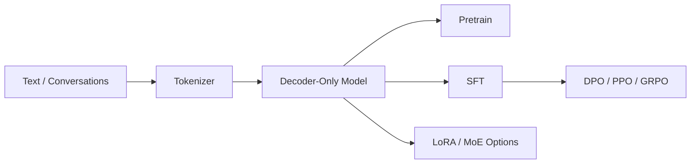

## AquilaLM: Open LLM Training Stack


A compact, readable LLM training stack that covers pretraining, supervised fine-tuning, and preference optimization. It focuses on clear implementations of core techniques and stable training workflows.

### Highlights
- End-to-end pipeline: Pretrain, SFT, DPO, PPO, GRPO
- Model building blocks: RoPE (with YaRN scaling), GQA, optional MoE
- Training stability: AMP, gradient accumulation, clipping, resume, DDP
- Data tooling: SFT/DPO datasets with loss-mask design
- Parameter-efficient tuning: LoRA adapters

### Architecture Diagram


### Repository Layout
- [main.py](main.py): entry point (stub)
- model/
	- [model.py](model/model.py): core model, RoPE, GQA, MoE
	- [model_lora.py](model/model_lora.py): LoRA adapters
- dataset/
	- [lm_dataset.py](dataset/lm_dataset.py): Pretrain/SFT/DPO datasets
- trainer/
	- [train_pretrain.py](trainer/train_pretrain.py): pretraining
	- [train_full_sft.py](trainer/train_full_sft.py): full SFT
	- [train_dpo.py](trainer/train_dpo.py): DPO
	- [train_ppo.py](trainer/train_ppo.py): PPO
	- [train_grpo.py](trainer/train_grpo.py): GRPO
	- [trainer_utils.py](trainer/trainer_utils.py): training utilities

### Quickstart
```bash
# Pretrain
python trainer/train_pretrain.py --data_path ../dataset/pretrain_hq.jsonl

# SFT
python trainer/train_full_sft.py --data_path ../dataset/sft_mini_512.jsonl

# DPO
python trainer/train_dpo.py --data_path ../dataset/dpo.jsonl

# PPO / GRPO
python trainer/train_ppo.py --data_path ../dataset/rl.jsonl
python trainer/train_grpo.py --data_path ../dataset/rl.jsonl
```

### Docs
- See [docs/README.md](docs/README.md) for a guided tour.
- See [docs/GETTING_STARTED.md](docs/GETTING_STARTED.md) for setup notes.

### Notes
This repository contains only code and public-facing documentation. Internal notes and drafts should be kept outside the repo before publishing.
