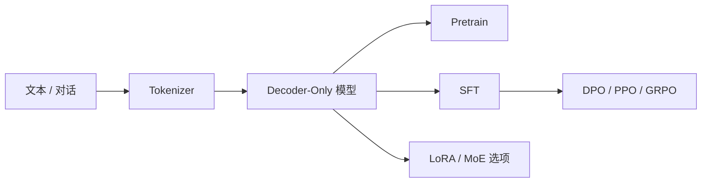

## AquilaLM: 开源 LLM 训练栈


一个紧凑、可读的 LLM 训练栈，覆盖预训练、监督微调与偏好优化流程，强调核心技术的清晰实现与稳定训练策略。

### 亮点
- 端到端流程：Pretrain、SFT、DPO、PPO、GRPO
- 模型组件：RoPE (含 YaRN 缩放)、GQA、可选 MoE
- 训练稳定性：AMP、梯度累积、裁剪、断点续训、DDP
- 数据工具：SFT/DPO 数据集与 loss mask 设计
- 参数高效微调：LoRA 适配器

### 架构示意


### 目录结构
- [main.py](main.py): 入口 (占位)
- model/
	- [model.py](model/model.py): 模型主体、RoPE、GQA、MoE
	- [model_lora.py](model/model_lora.py): LoRA 适配器
- dataset/
	- [lm_dataset.py](dataset/lm_dataset.py): Pretrain/SFT/DPO 数据集
- trainer/
	- [train_pretrain.py](trainer/train_pretrain.py): 预训练
	- [train_full_sft.py](trainer/train_full_sft.py): 全量 SFT
	- [train_dpo.py](trainer/train_dpo.py): DPO
	- [train_ppo.py](trainer/train_ppo.py): PPO
	- [train_grpo.py](trainer/train_grpo.py): GRPO
	- [trainer_utils.py](trainer/trainer_utils.py): 训练工具函数

### 快速开始
```bash
# 预训练
python trainer/train_pretrain.py --data_path ../dataset/pretrain_hq.jsonl

# SFT
python trainer/train_full_sft.py --data_path ../dataset/sft_mini_512.jsonl

# DPO
python trainer/train_dpo.py --data_path ../dataset/dpo.jsonl

# PPO / GRPO
python trainer/train_ppo.py --data_path ../dataset/rl.jsonl
python trainer/train_grpo.py --data_path ../dataset/rl.jsonl
```

### 文档
- 参见 [docs/README.md](docs/README.md) 获取导览
- 参见 [docs/GETTING_STARTED.md](docs/GETTING_STARTED.md) 获取环境配置说明

### 说明
本仓库仅包含代码与对外文档。内部笔记或草稿请勿提交到仓库。
